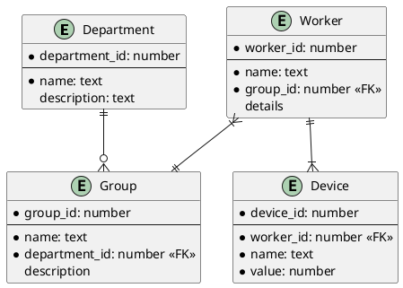

# Company Device Register

## Description
This microservice stores departments, groups, workers and their devices.
Workers can have multiple devices and each worker is assigned to a group. A department is built by a set of groups.

## Backend
### Entity Relationship Diagram

### Endpoints
#### Device (/device)
| Method | Input         | Output         | Path  |
|--------|---------------|----------------|-------|
| POST   | DeviceRequest | DeviceResponse | -     |
| GET    | -             | DeviceResponse | /{id} |
| DELETE | -             | -              | /{id} |

#### Worker (/worker)
| Method | Input         | Output         | Path  |
|--------|---------------|----------------|-------|
| POST   | WorkerRequest | WorkerResponse | -     |
| GET    | -             | WorkerResponse | /{id} |
| PUT    | WorkerRequest | id             | /{id} |
| DELETE | -             | -              | /{id} |

#### Group (/group)
| Method | Input         | Output        | Path  |
|--------|---------------|---------------|-------|
| POST   | GroupRequest  | GroupResponse | -     |
| GET    | -             | GroupResponse | /{id} |
| DELETE | -             | -             | /{id} |

#### Department (/department)
| Method | Input             | Output             | Path  |
|--------|-------------------|--------------------|-------|
| POST   | DepartmentRequest | DepartmentResponse | -     |
| GET    | -                 | DepartmentResponse | /{id} |

## Frontend

